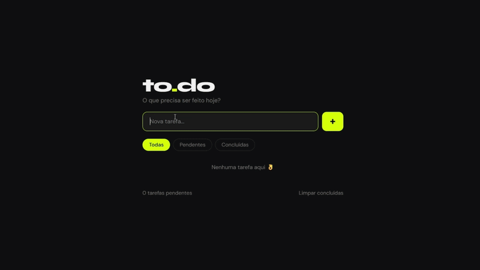

# ✅ To-Do List

Construído com HTML, CSS e JavaScript puro.

---

## 🔥 Funcionalidades

- Adicionar tarefa com botão ou tecla **Enter**
- Marcar tarefa como concluída
- Deletar tarefa individual
- Filtrar por: **Todas / Pendentes / Concluídas**
- Limpar todas as tarefas concluídas de uma vez
- Contador de tarefas pendentes
- **Dados salvos** mesmo ao fechar o navegador (localStorage)
- Animação de entrada dos itens

---

## 🛠 Tecnologias

---

## 🚀 Como rodar

Sem instalação. Basta abrir o `index.html` no navegador.

---

Feito por <a href="https://github.com/biacarollin">biacarollin</a> 🖤

